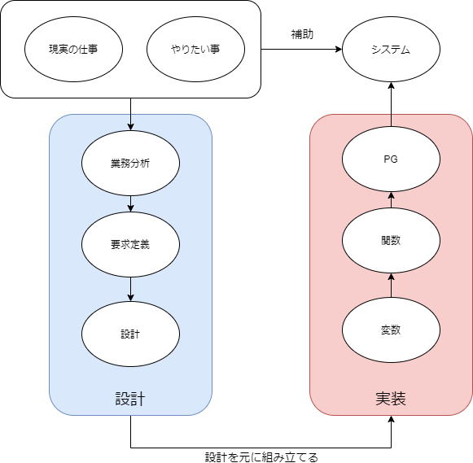

## 01
[オブジェクト指向でなぜつくるのか 第2版 \| 平澤 章 \|本 \| 通販 \| Amazon](https://www.amazon.co.jp/%E3%82%AA%E3%83%96%E3%82%B8%E3%82%A7%E3%82%AF%E3%83%88%E6%8C%87%E5%90%91%E3%81%A7%E3%81%AA%E3%81%9C%E3%81%A4%E3%81%8F%E3%82%8B%E3%81%AE%E3%81%8B-%E7%AC%AC2%E7%89%88-%E5%B9%B3%E6%BE%A4-%E7%AB%A0/dp/4822284654)

### 第4章 P110～P112
OOP(オブジェクト指向プログラミング)は無駄を省き、整理整頓するための書き方。

### パッケージとは
クラスをまとめるための入れ物。  
フォルダとファイルの関係に近く、階層構造も作れる。

主な目的は複数のクラスをある役割にまとめてパッケージに収めて使いやすくする。そしてクラスの名前の重複を避ける。

## 02 03
[オブジェクト指向でなぜつくるのか 第2版 \| 平澤 章 \|本 \| 通販 \| Amazon](https://www.amazon.co.jp/%E3%82%AA%E3%83%96%E3%82%B8%E3%82%A7%E3%82%AF%E3%83%88%E6%8C%87%E5%90%91%E3%81%A7%E3%81%AA%E3%81%9C%E3%81%A4%E3%81%8F%E3%82%8B%E3%81%AE%E3%81%8B-%E7%AC%AC2%E7%89%88-%E5%B9%B3%E6%BE%A4-%E7%AB%A0/dp/4822284654)

### 第4章 P112～P114
OOP(オブジェクト指向プログラミング)は無駄を省き、整理整頓するための書き方。

### 例外とは
例外とはOOPの新しい仕組みで「戻り値とは違う形式で、メソッドから特別なエラーを返す仕組み」

例外仕組みが生まれる以前は  
構造化の仕組みの中でエラーの処理を実装していた。

処理はサブルーチンの戻り値としてエラーコードを返すことで実装する。
この方法には2つ問題があった。

1. 呼び出し側で返却されたエラーコードの判定が必要
2. 一つ上の呼び出し側でエラーコード判定出来ない場合は  
更に上の階層で判定処理が必要

それをOOPの**例外**の仕組みを使用すると  
特別なエラーのがあることをメソッドで宣言して、  
呼び出し側で例外を処理または呼び出し側のメソッドで例外を宣言。

メソッドで発生した例外の処理を行う役割が  
自分ではなく自分の上位メソッドであった場合は  
自身のメソッドに例外が発生する可能性があることを宣言して
上位メソッドへ例外を伝える。

### Cでの例外処理
Cなどでは主に**try-catch文**を使用して例外を処理している。

```c
// try-catch文
try
{
  // 例外が投げられる可能性のあるコード
}
catch(例外の種類)
{
  // 例外処理コード
}
```
tryに対しての例外をcatchで掴み、例外の処理を行う。  
tryに記述されたメソッドの下の階層のどこで例外が発生してもcatchで掴むことができる。

```c
// try-catch文
try
{
  // 例外が投げられる可能性のあるコード
}
catch(Exception ex)
{
  // 例外を呼び出し側へ再スローする
  throw ex;
}
```
catchに**throw文**を記述することで自分の上位階層の  
catchへ例外を渡すことができる。

### 不明点
- エラーと例外

## 06
[オブジェクト指向でなぜつくるのか 第2版 \| 平澤 章 \|本 \| 通販 \| Amazon](https://www.amazon.co.jp/%E3%82%AA%E3%83%96%E3%82%B8%E3%82%A7%E3%82%AF%E3%83%88%E6%8C%87%E5%90%91%E3%81%A7%E3%81%AA%E3%81%9C%E3%81%A4%E3%81%8F%E3%82%8B%E3%81%AE%E3%81%8B-%E7%AC%AC2%E7%89%88-%E5%B9%B3%E6%BE%A4-%E7%AB%A0/dp/4822284654)

### 第4章 P114～P119
OOP(オブジェクト指向プログラミング)は無駄を省き、整理整頓するための書き方。

### ガベージコレクションとは
OOPで作成したインスタンスを自動的にシステムが削除してくれるという仕組みのこと。  
これでプログラマーがコードに記述することなく、メモリのやりくりを行ってくれる。

### OOPのまとめ
OOPはプログラムを「型にはめて」作る人が楽をするためのもの。  
何度も同じ処理を書きたくないので再利用できないか、同じような処理は部品でまとめてわかりやすくしたい。その様な要望や問題があって生まれた仕組み。

## 07
[オブジェクト指向でなぜつくるのか 第2版 \| 平澤 章 \|本 \| 通販 \| Amazon](https://www.amazon.co.jp/%E3%82%AA%E3%83%96%E3%82%B8%E3%82%A7%E3%82%AF%E3%83%88%E6%8C%87%E5%90%91%E3%81%A7%E3%81%AA%E3%81%9C%E3%81%A4%E3%81%8F%E3%82%8B%E3%81%AE%E3%81%8B-%E7%AC%AC2%E7%89%88-%E5%B9%B3%E6%BE%A4-%E7%AB%A0/dp/4822284654)

### 第7章 P187～P191
汎用の整理術に化けたオブジェクト指向

### 汎用の整理術とは
オブジェクト指向のもうひとつの側面のこと。  
オブジェクト指向は初めは下流工程から、次第に上流工程にも使用されるようになった。  
しかし、だからといって現実世界全てがオブジェクト指向で整理できるわけではない、  
コンピュータは「現実世界の仕事の一部」を肩代わりしていてその一部の中での物事を整理しているだけ。

### 上流工程に応用されるオブジェクト指向の考え方
まず上流工程とはシステム開発の前段階で行う「業務分析」や「要件定義」のこと。  
上流工程の中では主に集合論と役割分担にオブジェクト指向の考え方が使用された。

## 08
[オブジェクト指向でなぜつくるのか 第2版 \| 平澤 章 \|本 \| 通販 \| Amazon](https://www.amazon.co.jp/%E3%82%AA%E3%83%96%E3%82%B8%E3%82%A7%E3%82%AF%E3%83%88%E6%8C%87%E5%90%91%E3%81%A7%E3%81%AA%E3%81%9C%E3%81%A4%E3%81%8F%E3%82%8B%E3%81%AE%E3%81%8B-%E7%AC%AC2%E7%89%88-%E5%B9%B3%E6%BE%A4-%E7%AB%A0/dp/4822284654)

### 第7章 P191～P192
汎用の整理術に化けたオブジェクト指向

### 集合論
オブジェクト指向のクラスとインスタンスは集合論に応用された。  
例：山田さんと佐藤さんがインスタンスで、学生がクラス。

共通の元となるグループ(全体集合)をクラス、そこに集まる要素(部分集合)をインスタンスのように考える。

## 09
[オブジェクト指向でなぜつくるのか 第2版 \| 平澤 章 \|本 \| 通販 \| Amazon](https://www.amazon.co.jp/%E3%82%AA%E3%83%96%E3%82%B8%E3%82%A7%E3%82%AF%E3%83%88%E6%8C%87%E5%90%91%E3%81%A7%E3%81%AA%E3%81%9C%E3%81%A4%E3%81%8F%E3%82%8B%E3%81%AE%E3%81%8B-%E7%AC%AC2%E7%89%88-%E5%B9%B3%E6%BE%A4-%E7%AB%A0/dp/4822284654)

### 第7章 まとめ
汎用の整理術に化けたオブジェクト指向

### オブジェクト指向の二つの使われ方
1. 具体的な問題(プログラム)に対しての整理術
2. 抽象的な問題(システム設計)に対しての整理術

対象は違えど、どちらもオブジェクト指向と呼べるのでこれが混乱を招く。

オブジェクト指向の「クラス」という用語一つでも、1の場合か2の場合かによって意味合いが変わる。

### 抽象的な問題に対しての整理術とは
システム設計などの上流工程を対象に、オブジェクト指向の考え方を適用したもの。  
しかし、現実世界=オブジェクト指向ではないので
その考え方の一部を応用した。  
主に上流工程の「集合論」「役割分担」に適用された。

1. 集合論 : 「クラス」と「インスタンス」の考え方
2. 役割分担 : 「メッセージパッシング」の考え方

### オブジェクト指向を正しく理解するには
人が理解しやすく扱いやすいように整理するのが「オブジェクト指向の仕組み」。  
目的はシンプルでわかりやすいが、「プログラム」と「設計」のどちらを対象にした整理術であるか、きちんと分けて考えることが正しい理解につながる。

## 10
[オブジェクト指向でなぜつくるのか 第2版 \| 平澤 章 \|本 \| 通販 \| Amazon](https://www.amazon.co.jp/%E3%82%AA%E3%83%96%E3%82%B8%E3%82%A7%E3%82%AF%E3%83%88%E6%8C%87%E5%90%91%E3%81%A7%E3%81%AA%E3%81%9C%E3%81%A4%E3%81%8F%E3%82%8B%E3%81%AE%E3%81%8B-%E7%AC%AC2%E7%89%88-%E5%B9%B3%E6%BE%A4-%E7%AB%A0/dp/4822284654)

### 第8章 P203～
UMLは形のないソフトウェアを見る道具

### UMLとは
上流工程から下流工程までをカバーするソフトウェアの  
機能や構造を表す図のこと

UMLには複数の種類があり、今回はその中の  
「クラス図」「アクティビティ図」「ステートマシン図」の3つについてまとめる。

### UMLの3つの使われ方
UML図はそもそも物事の関係や流れを分かりやすくするもの。  
しかし、全て同じように図で表現できないため**説明したい物**によってUML図の種類や使い方を変える。

使い方を3つに分けた場合以下のようになる。

1. プログラムの構造や動作を表現
2. システム設計の視点から成果物を表現
3. オブジェクト指向で表せない情報を表現

1を図で表現するには「クラス図」などを使用する。  
2を図で表現するには「コミュニケーション図」などを使用する。  
3を図で表現するには「アクティビティ図」「ステートマシン図」などを使用する。

### クラス図とは
クラスを基本単位としたオブジェクト指向のプログラム構造を図にしたもの。  
プログラムの構造や関係を図に起こすことによって**全体像の把握と記憶をしやすくすることが目的**

## 13
[オブジェクト指向でなぜつくるのか 第2版 \| 平澤 章 \|本 \| 通販 \| Amazon](https://www.amazon.co.jp/%E3%82%AA%E3%83%96%E3%82%B8%E3%82%A7%E3%82%AF%E3%83%88%E6%8C%87%E5%90%91%E3%81%A7%E3%81%AA%E3%81%9C%E3%81%A4%E3%81%8F%E3%82%8B%E3%81%AE%E3%81%8B-%E7%AC%AC2%E7%89%88-%E5%B9%B3%E6%BE%A4-%E7%AB%A0/dp/4822284654)

### 第8章 P203～
UMLは形のないソフトウェアを見る道具

### ステートマシン図(状態遷移図)とは
外部からのイベントによって変化する
モノの状態の遷移を表した図。  
開始から停止までを状態の移行を表した矢印で結んだ図。

プログラムのクラスとインスタンスの関係や、  
システム全体の遷移図など幅広く使われる。

### アクティビティ図とは
現実世界の仕事の流れと時間を表した図。  
誰がどんな仕事行っているかを表すことによって  
作成する資料やシステムの目的地を定めやすくする。

Actor(役者)がいて、  
時間は縦軸、上から下に行くほど時間が経っていることになる。  
役者間の仕事の流れを矢印で表す。

### 注意点
UMLは対象とするモノによって  
プログラム自体を図にしたり、現実世界の物事を図にすることがある。

## 14
[オブジェクト指向でなぜつくるのか 第2版 \| 平澤 章 \|本 \| 通販 \| Amazon](https://www.amazon.co.jp/%E3%82%AA%E3%83%96%E3%82%B8%E3%82%A7%E3%82%AF%E3%83%88%E6%8C%87%E5%90%91%E3%81%A7%E3%81%AA%E3%81%9C%E3%81%A4%E3%81%8F%E3%82%8B%E3%81%AE%E3%81%8B-%E7%AC%AC2%E7%89%88-%E5%B9%B3%E6%BE%A4-%E7%AB%A0/dp/4822284654)

### 第8章 P203～
UMLは形のないソフトウェアを見る道具

### UMLまとめ
UMLは統一モデリング**言語**と呼ばれていて、  
人間同士で交わす自然言語とPC内部のプログラミング言語の間で仲介を行うためのもの。

上流の抽象度が高いものと抽象度が低い下流、両者の欠点を補い  
図でもって直感的に表現する。  
上流工程と下流工程の交流(コミュニケーション)を助けることから  
図という手段で伝える**言語**であると言える。

## 15
[オブジェクト指向でなぜつくるのか 第2版 \| 平澤 章 \|本 \| 通販 \| Amazon](https://www.amazon.co.jp/%E3%82%AA%E3%83%96%E3%82%B8%E3%82%A7%E3%82%AF%E3%83%88%E6%8C%87%E5%90%91%E3%81%A7%E3%81%AA%E3%81%9C%E3%81%A4%E3%81%8F%E3%82%8B%E3%81%AE%E3%81%8B-%E7%AC%AC2%E7%89%88-%E5%B9%B3%E6%BE%A4-%E7%AB%A0/dp/4822284654)

### 第9章 P233～P238
現実世界とソフトウェアのギャップを埋めるモデリング

### 現実世界とソフトウェアのギャップとは
いくら楽がしたいからといって、すべての仕事をPCには任せることはできない。  
なぜならPCが得意な事は「決まり切った仕事」と「覚える仕事」のため、  
現実世界の一部の仕事しか肩代わりできない。

### ソフトウェア開発に必要なこと
開発する上で必要な3つの工程。

1. 業務分析 ： 現実世界の仕事の進め方の整理
2. 要求定義 ： PCに任せる仕事の範囲を決める
3. 設計 ： ソフトウェアをどう作るか

また、これらの抽象度違う3工程を使った開発を円滑に進めるために  
使用する技術のことを**モデリング**という。

## 16
[オブジェクト指向でなぜつくるのか 第2版 \| 平澤 章 \|本 \| 通販 \| Amazon](https://www.amazon.co.jp/%E3%82%AA%E3%83%96%E3%82%B8%E3%82%A7%E3%82%AF%E3%83%88%E6%8C%87%E5%90%91%E3%81%A7%E3%81%AA%E3%81%9C%E3%81%A4%E3%81%8F%E3%82%8B%E3%81%AE%E3%81%8B-%E7%AC%AC2%E7%89%88-%E5%B9%B3%E6%BE%A4-%E7%AB%A0/dp/4822284654)

### 第9章 P238～P255
現実世界とソフトウェアのギャップを埋めるモデリング

### システム開発関連の認識間違い修正

UML：UML=図ではない、書き方をなるべく共通化させるための規格。  
システム：現実の仕事とやりたい事を補助する。  
モデリング：
* 現実の業務を単純化して図で表現することで、設計を分かりやすくする。
* 図示することで業務の解釈間違いも回避できる。
* プログラマーに説明しやすい。


## 17
[オブジェクト指向でなぜつくるのか 第2版 \| 平澤 章 \|本 \| 通販 \| Amazon](https://www.amazon.co.jp/%E3%82%AA%E3%83%96%E3%82%B8%E3%82%A7%E3%82%AF%E3%83%88%E6%8C%87%E5%90%91%E3%81%A7%E3%81%AA%E3%81%9C%E3%81%A4%E3%81%8F%E3%82%8B%E3%81%AE%E3%81%8B-%E7%AC%AC2%E7%89%88-%E5%B9%B3%E6%BE%A4-%E7%AB%A0/dp/4822284654)

### 第9章 P233～P
現実世界とソフトウェアのギャップを埋めるモデリング

### 注意点
モデリングで図を作ることが「設計」の目的ではない。  
あくまで、設計段階の資料をより伝わりやすくするためのもの。

目的は**お客さんの仕事の仕組みを理解と要望の洗い出し(設計)**  
を行って、**システムを作成(実装)**。  
最終的に「**お客さんの要望を叶えて実装前より便利**」にすること。

## 20
[オブジェクト指向でなぜつくるのか 第2版 \| 平澤 章 \|本 \| 通販 \| Amazon](https://www.amazon.co.jp/%E3%82%AA%E3%83%96%E3%82%B8%E3%82%A7%E3%82%AF%E3%83%88%E6%8C%87%E5%90%91%E3%81%A7%E3%81%AA%E3%81%9C%E3%81%A4%E3%81%8F%E3%82%8B%E3%81%AE%E3%81%8B-%E7%AC%AC2%E7%89%88-%E5%B9%B3%E6%BE%A4-%E7%AB%A0/dp/4822284654)

### 第10章 P261～P
擬人化して役割分担させるオブジェクト指向設計

### 設計段階で保守性や再利用性を高める方法
システム開発の工程には「業務分析」「要求定義」「設計」がある。  
今回はこの「設計」の段階で保守性や再利用性を高める方法をについて記述する。

1. 重複を排除する
2. 部品の独立性を高める
3. 依存関係を重複させない

この3つのポイントがあり、オブジェクト指向プログラミングの説明でもあったように  
処理を分割・整理することで保守性や再利用性が高まる。

## 21
[オブジェクト指向でなぜつくるのか 第2版 \| 平澤 章 \|本 \| 通販 \| Amazon](https://www.amazon.co.jp/%E3%82%AA%E3%83%96%E3%82%B8%E3%82%A7%E3%82%AF%E3%83%88%E6%8C%87%E5%90%91%E3%81%A7%E3%81%AA%E3%81%9C%E3%81%A4%E3%81%8F%E3%82%8B%E3%81%AE%E3%81%8B-%E7%AC%AC2%E7%89%88-%E5%B9%B3%E6%BE%A4-%E7%AB%A0/dp/4822284654)

### 第10章 P261～P
擬人化して役割分担させるオブジェクト指向設計

### 擬人化と役割分担
人が複雑な仕事を行うときに役割分担するように  
ソフトウェアもサブシステムや部品に役割分担する。
すると自然とソフトウェア側が擬人化される。

オブジェクト指向でソフトウェアを作る場合、  
独立性や再利用生の高いプログラムを作るために  
命を持たないモノ(オブジェクト)が役割を分担して  
相互に連絡を取り合いながら仕事を達成するように設計する。

## 22
[オブジェクト指向でなぜつくるのか 第2版 \| 平澤 章 \|本 \| 通販 \| Amazon](https://www.amazon.co.jp/%E3%82%AA%E3%83%96%E3%82%B8%E3%82%A7%E3%82%AF%E3%83%88%E6%8C%87%E5%90%91%E3%81%A7%E3%81%AA%E3%81%9C%E3%81%A4%E3%81%8F%E3%82%8B%E3%81%AE%E3%81%8B-%E7%AC%AC2%E7%89%88-%E5%B9%B3%E6%BE%A4-%E7%AB%A0/dp/4822284654)

### 第10章 P261～P
擬人化して役割分担させるオブジェクト指向設計

### 部品の独立性を高める
凝集度を強め、結合度は弱くする考え方  
(部品が分かりやすくまとまっていて、部品間の結びつきは弱く)

考え方のコツ  
- クラスの名前は機能を「ひとことで分かりやすい名前」にする
- クラスが外部に伝える情報は最小限にして「隠す」
- クラスやメソッドはなるべく小さく

## 27
[オブジェクト指向でなぜつくるのか 第2版 \| 平澤 章 \|本 \| 通販 \| Amazon](https://www.amazon.co.jp/%E3%82%AA%E3%83%96%E3%82%B8%E3%82%A7%E3%82%AF%E3%83%88%E6%8C%87%E5%90%91%E3%81%A7%E3%81%AA%E3%81%9C%E3%81%A4%E3%81%8F%E3%82%8B%E3%81%AE%E3%81%8B-%E7%AC%AC2%E7%89%88-%E5%B9%B3%E6%BE%A4-%E7%AB%A0/dp/4822284654)

### 第12章 P305～P311
オブジェクト指向を使いこなそう

### オブジェクト指向の特徴
オブジェクト指向は様々な技術を取り込み広がっていくという特徴を持っている。  
そのため、オブジェクト指向の考え方は設計から開発まで幅広く適用されていて  
「難しいシステムの開発を楽にするための総合技術」といえる。

### オブジェクト指向は目的ではなく手段の一つ
何も考えず全てにオブジェクト指向を持ち込むとかえって  
物事が複雑になる可能性がある。  
あくまで、主目的を達成するために必要であった場合に使用する  
手段の一つであることを意識する必要がある。

## 28
[オブジェクト指向でなぜつくるのか 第2版 \| 平澤 章 \|本 \| 通販 \| Amazon](https://www.amazon.co.jp/%E3%82%AA%E3%83%96%E3%82%B8%E3%82%A7%E3%82%AF%E3%83%88%E6%8C%87%E5%90%91%E3%81%A7%E3%81%AA%E3%81%9C%E3%81%A4%E3%81%8F%E3%82%8B%E3%81%AE%E3%81%8B-%E7%AC%AC2%E7%89%88-%E5%B9%B3%E6%BE%A4-%E7%AB%A0/dp/4822284654)

### 第12章 P305～P311
オブジェクト指向を使いこなそう

### オブジェクト指向を学ぶ意義
新たな技術として、「アスペクト指向」「エージェント指向」「サービス指向」  
などが生まれて来ているが基本はオブジェクト指向の考え方や要素を  
引き継いでいるため、今後のプログラミング技術を学ぶ上でも重要。

## 30
[【初心者向け】Node\.jsとは?を初心者ながらまとめてみた \- Qiita](https://qiita.com/takuya_tsurumi/items/e16db3d95b72cdb2a48d)

### Node.jsとは
拡張性の高いネットワークアプリケーションを作成するために  
生まれた「**非同期型**」の「**イベント駆動**」の「**JavaScript環境**」

### 同期処理と非同処理
処理Aと処理Bがあったとして、処理Aの途中で処理Bへ移った場合  
それまでやっていたAの処理は待ち状態になり、Bの処理を行う。  
これが**同期処理**。

上記の処理を行った際に処理Aを待たせずに同時進行で  
処理Bも実行できるのが**非同期処理**。

### 不明な点
- JavaScript環境
